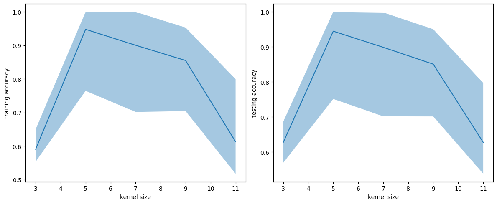

# visual-search-classifier

## Overview

This project implements and compares three machine learning models (MLP, SVM, and CNN) to classify visual search images based on target presence. The goal is to evaluate the performance of different model architectures on the same dataset.

## Example Input / Output

### Example 1

Input:

Output:
Predicted class: Target present 

### Example 2

Input:

Output:
Predicted class: Target absent

### Results

MLP:

SVM:

CNN:

## Notes

This project was developed as part of a course project. The code reflects the experimental workflow used during development.

## Author

Saad Khan

