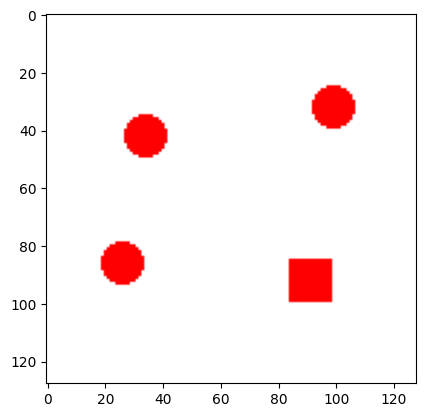
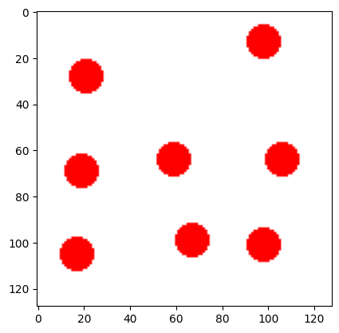
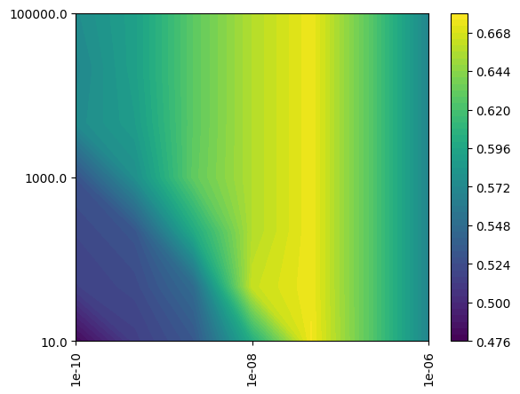

# visual-search-classifier

## Overview

This project implements and compares three machine learning models (MLP, SVM, and CNN) to classify visual search images based on target presence. The goal is to evaluate the performance of different model architectures on the same dataset.

## Example Input / Output

### Example 1

Input:

Output:
Predicted class: Target present 

### Example 2

Input:

Output:
Predicted class: Target absent

### Results

MLP:

Shaded region represents 95% confidence intervals. The plot shows accuracy over different features tested for an MLP model.

SVM:

The bright yellow colour represents high accuracy. The plot shows accuracy with varying c and gamma parameters of an SVM model.

CNN:

Shaded region represents 95% confidence intervals. The plot shows accuracy over different kernel sizes tested for a CNN model.

## Notes

This project was developed as part of a course project. The code reflects the experimental workflow used during development.

## Author

Saad Khan

